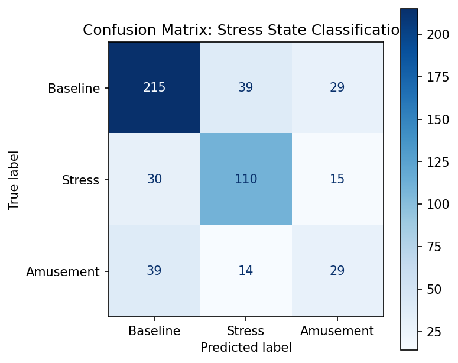
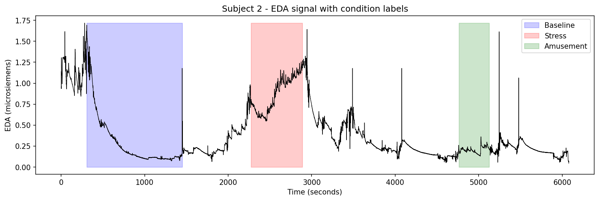

# Wearable Stress & Affect Detection

Classifying physiological state (baseline, stress, or amusement) from wrist-worn
wearable sensor data, and deploying the trained model as a live, interactive app.
This project applies signal processing and machine learning to a public benchmark
dataset, mirroring the kind of stress-detection feature found in consumer
wearables like Fitbit, Whoop, or Apple Watch.

**Live app:** [wearable-stress-detection-app.streamlit.app](https://wearable-stress-detection-app.streamlit.app)

## Motivation

Wearable devices collect continuous physiological data, but raw sensor readings
are only useful if they can be translated into meaningful state predictions. This
project investigates whether a person's physiological state — calm, stressed, or
amused — can be reliably classified from wrist-worn sensor signals (electrodermal 
activity(EDA) - a measure of skin conductance that rises with sympathetic nervous 
system arousal - heart rate, temperature, motion), and demonstrates the full pipeline
from raw signal to a deployed, usable tool.

## Dataset

[WESAD (Wearable Stress and Affect Detection)](https://www.eti.uni-siegen.de/ubicomp/home/datasets/icmi18/)
(Schmidt et al., 2018) — 15 subjects, wrist-worn Empatica E4 device (EDA, BVP,
temperature, accelerometer), recorded during three lab-induced conditions:
baseline (neutral reading), stress (Trier Social Stress Test), and amusement
(funny video clips).

## Methods

- **Windowing:** continuous recording was cut into 60-second segments (a
  window length commonly used in EDA-based stress detection research [2][3]).
  Since each segment could span a transition between conditions, only windows
  where at least 90% of the timepoints belonged to a single condition (baseline,
  stress, or amusement) were kept — this discards ambiguous boundary segments
  and ensures each window has a reliable, unambiguous label.
- **Feature extraction:** EDA statistics (mean, std, range), heart rate and heart
  rate variability (derived from BVP via peak detection), skin temperature
  statistics, and accelerometer magnitude statistics
- **Classifier:** linear SVM, evaluated with 5-fold cross-validation using
  balanced accuracy (to account for class imbalance across conditions)
- **Deployment:** trained model and scaler saved and served via a Streamlit app,
  with example signal windows for instant, no-setup interaction

## Key findings

### 1. Feature engineering meaningfully improved performance

| Feature set | Mean balanced accuracy |
|---|---|
| Raw signal statistics (EDA + raw BVP mean/std) | 45.5% |
| **EDA + engineered heart rate/HRV features** | **60.6%** |

Replacing raw BVP mean/std with physiologically targeted heart rate and heart
rate variability features improved balanced accuracy by ~15 percentage points,
without changing the classifier itself — demonstrating that domain-informed
feature engineering can matter more than model choice. This result is consistent
with the well-established link between heart rate variability and autonomic
stress response documented in the cardiovascular physiology literature [4].

### 2. Confusion matrix and feature importance

Baseline (76% correct) and stress (71% correct) are classified reasonably well;
amusement is the weakest class (35% correct), most often confused with baseline
rather than stress — plausible given amusement is a comparatively mild arousal
state, and the smallest class in the dataset (82 windows).

Random Forest feature importance confirms heart rate — the engineered feature
driving the accuracy improvement — as the single most predictive feature
(importance: 0.237), followed by temperature and EDA mean. Heart rate
variability ranked surprisingly low, likely reflecting the limitations of
deriving HRV from wrist-based PPG over short windows, compared to clinical-grade
ECG.

### 3. A note on window selection and sensitivity

During app testing, prediction confidence varied noticeably depending on exactly
which 60-second window was sampled within a condition — for example, different
windows within the same subject's stress period produced predictions ranging
from confidently incorrect to a near-tied, genuinely close call. This reflects a
real property of the underlying signal rather than model inconsistency:
physiological responses build and fluctuate over time rather than remaining
uniformly elevated throughout a condition. This is consistent with standard
practice in the literature, where models are evaluated using many overlapping
windows across a condition (commonly with 50%+ overlap) rather than a single
representative sample [2][3] — a distinction worth keeping in mind when
interpreting any single prediction from the deployed app.

## Deployed app

The trained model is deployed as an interactive Streamlit app where users can
select from example signal windows (one per condition) or upload their own, and
see a live prediction with a full confidence breakdown. The app surfaces an
uncertainty note automatically when a prediction is a close call (top confidence
below 60%), so predictions are never presented as more certain than they are.

**Try it:** [wearable-stress-detection-app.streamlit.app](https://wearable-stress-detection-app.streamlit.app)

## Notebooks

- `01_data_exploration.ipynb` — data loading, signal/label structure, EDA signal
  visualization with condition overlay
- `02_multi_subject_pipeline.ipynb` — windowing, feature extraction across 15
  subjects, classical ML baseline, feature engineering improvement, confusion
  matrix, feature importance, model export for deployment

## Tools

Python, MNE-adjacent signal processing (NumPy, SciPy), scikit-learn, Streamlit,
Matplotlib

## References

[1] Schmidt, P., Reiss, A., Duerichen, R., Marberger, C., & Van Laerhoven, K.
(2018). Introducing WESAD, a multimodal dataset for wearable stress and affect
detection. ICMI 2018.
[2] Albaladejo-González, M. et al. Stress Classification and Personalization:
Getting the most out of the least. arXiv:2107.05666.
[3] Bajpai, D. et al. SELF-CARE: Selective Fusion with Context-Aware Low-Power
Edge Computing for Stress Detection. arXiv:2205.03974.
[4] Kim, H. G., Cheon, E. J., Bai, D. S., Lee, Y. H., & Koo, B. H. (2018). Stress
and heart rate variability: A meta-analysis and review of the literature.
Psychiatry Investigation, 15(3), 235–245.

